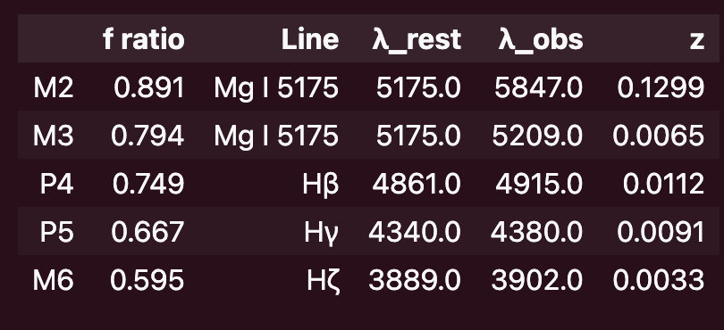
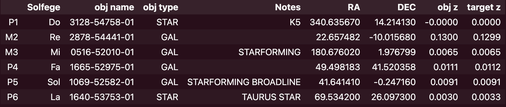
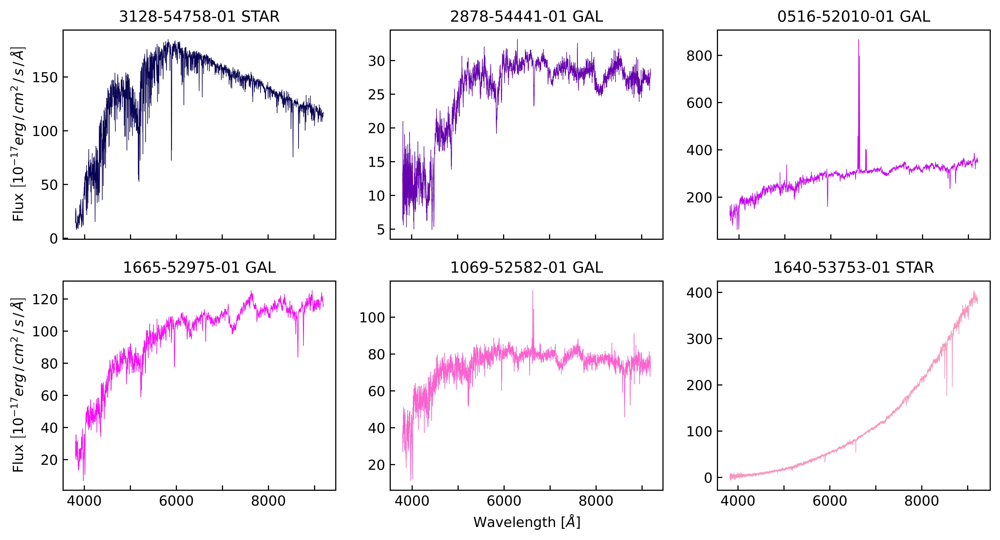
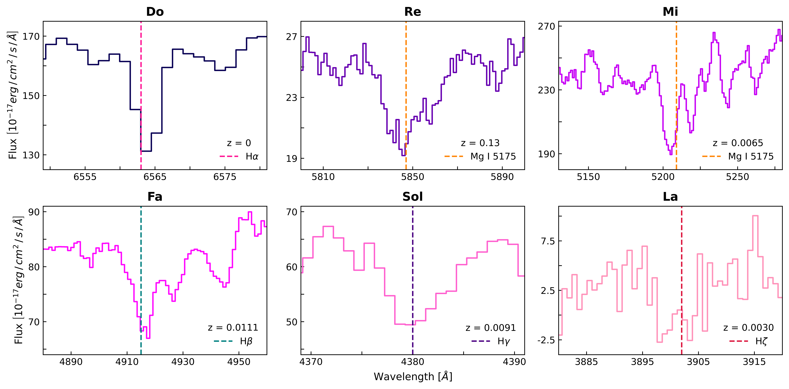

# Space Solfege
**Sofi Martínez Fortis**
---
---

### Abstract
---

Data sonification is a tool that has gained popularity in astronomy over the past decade. That's really cool and all, but in this project, I actually do the complete opposite. Instead of exploring how astronomical data translates into music, I study how music may manifest as astronomical data. In this project, I depict how the score of the classic nursery rhyme, "Twinkle Twinkle Little Star" would be written by means of stellar and galactic spectra.

---
### Methods

---

**Music Notes vs. Solfege**

Music notes are represented by letters A-G plus a number (i.e A0, A1, A2, etc. where a small number corresponds to a pitch lower than that corresponding to large number) and each note has a unique frequency.

Solfege is represented by syllables, Do, Re, Mi, Fa, Sol, La, and Ti. Unlike music notes, solfege does not have a unique frequency for each syllable. Instead, solfege focuses on the frequency ratio between two syllables. In other words, "Do" can have any frequency, but the ratio between "Do" and "Re" (or any other syllable) is always the same regardless of what frequency is assigned to "Do".

**Data Selection**

I use the solfege representation of "Twinkle Twinkle Little Star" to re-write the song with spectra. The subject-fitting tune only uses the syllables, Do, Re, Mi, Fa, Sol, and La. I choose the rest frequency of $H\alpha$ absorption line as my "Do" and calculate the frequencies corresponding to Re, Mi, Fa, Sol, and La. However, there are no spectral lines corresponding to the frequencies of the remaining syllables because that would be too easy and there is nothing easy peasy lemon squeezy about astronomy. To fix this issue, I pick prominent absorption lines near the desired frequencies and wavelengths and calculate the redshift needed for them to be centered about such frequencies and wavelengths.

*Table 1: The table shows the frequency ratio for each interval, the absorption line chosen to represent each interval, the absorption lines' rest wavelength, the wavelength needed for each interval, and the redshift necessary to achieve $\lambda_{obs}$. The indeces are the shorthand notation for Major 2nd, Major 3rd, Perfect 4th, Perfect 5th, and Major 6th, which are the (frequency) intervals that correspond to Do:Re, Do:Mi, Do:Fa, Do:Sol, and Do:La, respectively.*

I use the SDSS Science Archive Server (SAS) to download spectra of sources at each desired redshift. The fits files are stored in the "Data" folder.

*Table 2: The table displays some relevant information of each selected source. Note: 'obj z' is the redshift of the source, while 'target z' is the desired redshift (same as 'z' column in the previous table).*

**Important Files**

<u>functions.py:</u> 
Computes parameters in Table 1 and creates Table 1

<u>Midterm_Project.ipynb:</u> Analyzes spectra, computes plots, and creates Table 2.

<u>RP_final_result.pdf:</u> Music score with added "spectral score". The final result.

---
### Results
---
**NOTE: the final result is under "RP_final_result.pdf". This file depicts "Twinkle Twinkle Little Star" as spectra.**

*Figure 1: full spectrum of each source*

*Figure 2: Individual absorption lines corresponding to each syllable. The dashed lines represent the theoretical observed wavelengths of each syllable.*

### Remember to check RP_Midterm_final_result.pdf for the "spectral score". 

